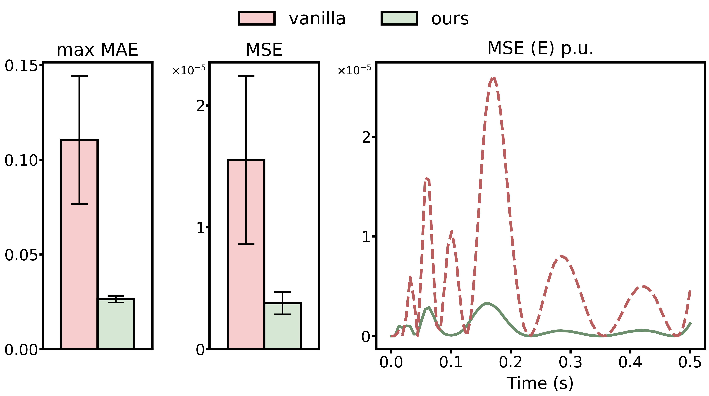
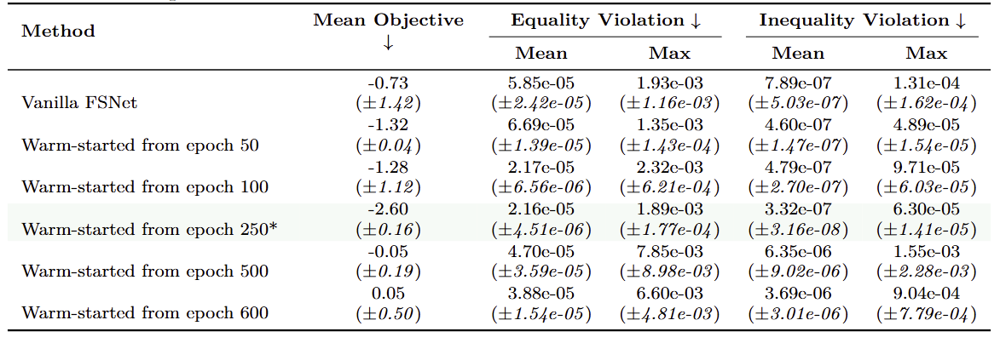
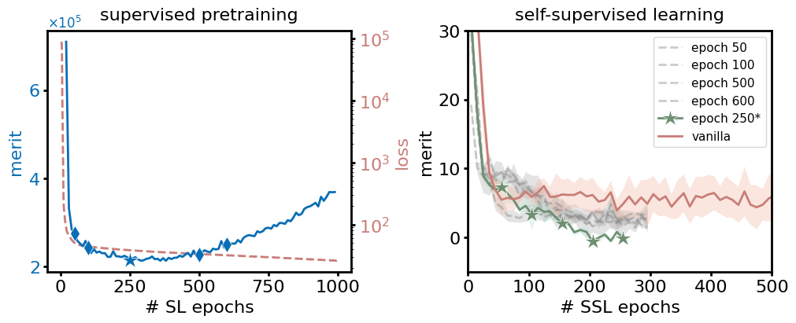
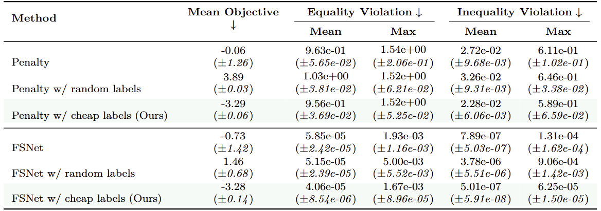
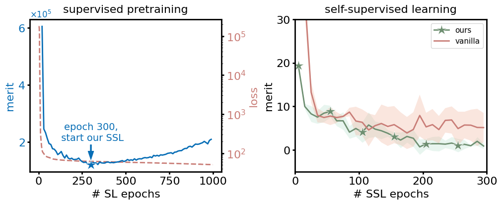

**We thank all reviewers for their thoughtful and constructive feedback. We have done our best to address all concerns and questions within the word limits. All additional assumptions, remarks, discussions, results, and references will be included in the revision.**

---

Figure R1. **Results of our approach for a PINN using R3 adaptive sampling on the dynamical system learning task.**

---

Table R1. **Performance comparison on a synthetic constrained optimization benchmark of SSL warm-started from different SL pretraining steps.** We use $7{,}000$ inexact labels (with a maximum CPU solve time of 2.0 s per label) for supervised warm-starting, SL achieves lowest validation merit at around epoch 250. We then perform FSNet SSL for 300 epochs from different SL pretraining steps. Results are reported over 4 random seeds.

---

Figure R2. **SL (left) and SSL (right) dynamics across epochs in the synthetic optimization task.** On the left, the solid curve (left y-axis) shows a U-shaped validation merit trajectory, while the dashed curve (right y-axis) shows the training supervised loss decreasing monotonically. On the right, our SSL, warm-started from the checkpoint with the lowest validation merit (epoch 250), outperforms vanilla SSL and other variants. This highlights the objective mismatch in purely data-driven training and the importance of our merit-based criterion. The total training cost of our method is the sum of "inexact but cheap" SL epochs and "faithful but expensive" SSL epochs. More comparison metrics are presented in Table R1.

---

Table R2. **Performance comparison on a synthetic constrained optimization benchmark of SSL with no warm-start, random label warm-start and cheap label warm-start.** We construct random solution labels via uniform sampling over a $\pm 3$ range in each dimension, which matches the scale of the solver-generated solutions. We generate $7{,}000$ such samples and perform supervised pretraining as in our standard pipeline. The last SL checkpoint is selected to warm-start SSL as it has lowest training loss and validation merit. Results are reported over 4 random seeds.

---

Figure R5. **A revised version of Figure 5 in the original paper to better clarify SL pretraining and SSL.** SL epochs are different from SSL epochs. Both are counted towards our method epochs.

## Additional references

Daw A, Bu J, Wang S, Perdikaris P, Karpatne A. Mitigating Propagation Failures in Physics-informed Neural Networks using Retain-Resample-Release (R3) Sampling. In International Conference on Machine Learning 2023 Jul 3 (pp. 7264-7302). PMLR. 

Hornik, K., Stinchcombe, M., and White, H. Multilayer feedforward networks are universal approximators. Neural networks, 2(5):359–366, 1989.

Du, S., Lee, J., Li, H., Wang, L., and Zhai, X. Gradient descent finds global minima of deep neural networks. In International conference on machine learning, pp. 1675– 1685. PMLR, 2019.

Allen-Zhu, Z., Li, Y., and Song, Z. A convergence theory for deep learning via over-parameterization. In International conference on machine learning, pp. 242–252. PMLR, 2019

Karniadakis, George Em, et al. "Physics-informed machine learning." Nature Reviews Physics 3.6 (2021): 422-440.
