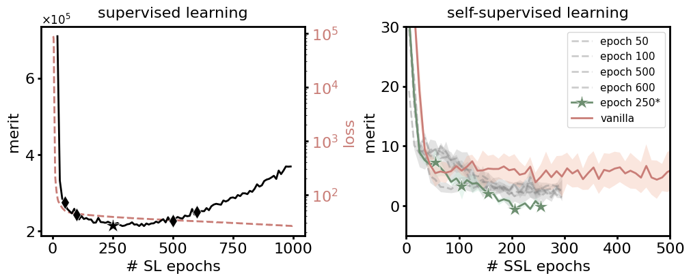
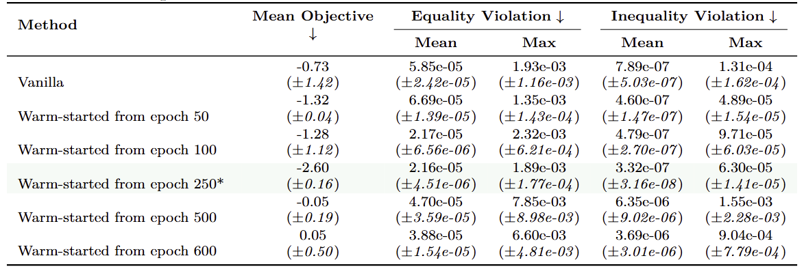

Figure R1. **Results of our approach for a PINN using R3 adaptive sampling on the physics-inspired learning task.**

---

Figure R2. **SL (left) and SSL (right) dynamics across epochs in the synthetic optimization task.** On the left, the solid curve (left y-axis) shows a U-shaped validation merit trajectory, while the dashed curve (right y-axis) shows the training supervised loss decreasing monotonically. On the right, our SSL, warm-started from the checkpoint with the lowest validation merit (epoch 250), outperforms vanilla SSL and other variants. This highlights the objective mismatch in purely data-driven training and the importance of our merit-based criterion. The total training cost of our method is the sum of "inexact but cheap" SL epochs and "faithful but expensive" SSL epochs.

---
Table R1. **Performance comparison on a synthetic constrained optimization benchmark of SSL warm-started from different SL pretraining steps. SL achieves lowest validation merit at around epoch 250.**

---
Table R2. **Performance comparison on a synthetic constrained optimization benchmark of SSL with no warm-start, random label warm-start and cheap label warm-start.**

